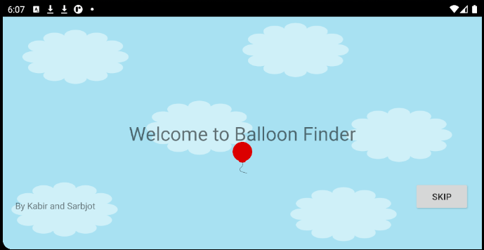
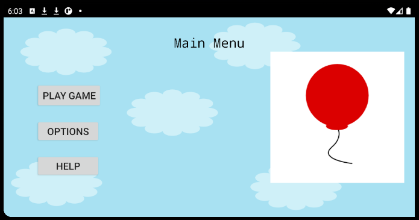
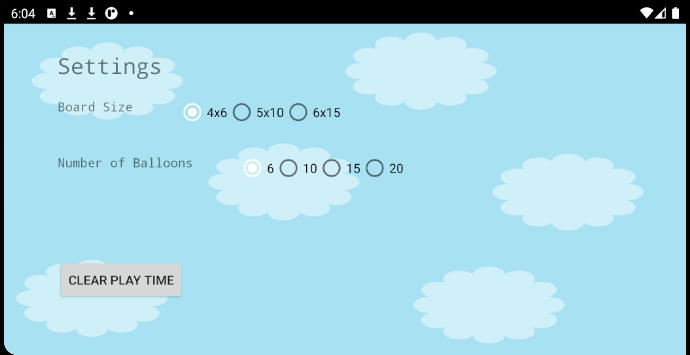
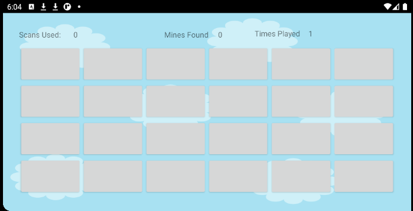
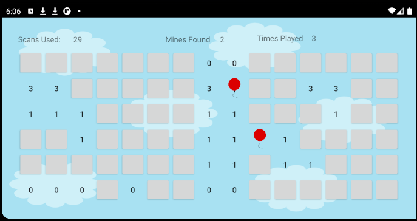

# Balloon-Finder

[]
[]

Balloon Finder is a type of Mineseeker game where the goal is to find all of the mines, or in this case Balloons! When the applications is first booted up a ten second animation is played, which users can either watch which then redirects them to the main menu, or press the skip button. Afterwards the user have 9 possible games to choose from. Games vary depending on board size and number of mines.

# Sample Output
                             
| Screenshot       | Explanation                                      
|---------------|----------------------|
|        | When the user opens the animation they are greeted with the animation which they can either skip or watch
|        | Main Menu Screen where the user can see the "canon" of the game, change settings or press play to play the default game
|        | Different Settings Users Can change
|         |  Different Board sizes, and playing the game
